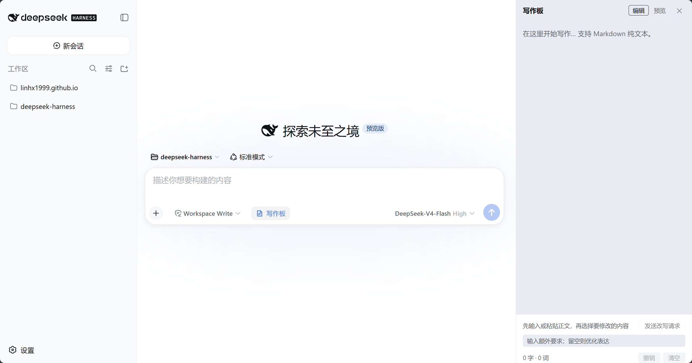

# dsh-writing-pad

[简体中文](README.md) · [English](README.en.md)

A session-scoped Markdown writing pad for the DeepSeek Harness web GUI. It docks beside the conversation, keeping drafting, preview, and focused AI rewrites in one workflow.



## Highlights

- **Open it anytime:** the labeled writing-pad control opens or closes the right column, including before a new session's first message, and stays open while switching sessions.
- **Focused rewrites:** selecting text focuses the multi-line instruction editor; its DSH-style send button is pale blue while requirements are blank and full blue after input. Dragging either its top edge or the tool area's top edge moves both together while the editor's bottom edge stays anchored. Resize hints appear only on hover or focus, and reusable defaults persist in the browser.
- **Review before apply:** `writing_draft` produces a candidate shown as a highlighted Diff. Accept or reject it; leaving review accepts it by default.
- **Visible state:** copied, generated, review-pending, and failure states use DSH theme-aware soft semantic pills beside the default-instruction actions on one compact row.
- **Clean conversations:** the complete draft reaches the model, while the visible message bubble shows only the selected passage and additional instruction.
- **Session-scoped state:** drafts remain isolated by session, with edit/preview modes, full-draft copy, clear, and up to 50 undo steps.
- **No workspace writes:** drafts are staged in Host memory and never create or overwrite project files automatically.

## Install

Install the `dsh` CLI first, then add the latest stable release to the web profile:

```sh
dsh plugin --profile web add dsh-writing-pad
```

Start the web GUI:

```sh
dsh web
```

For local development, package and reinstall the current version, then start the web GUI with:

```sh
pnpm dev
```

## Usage

1. Click “Writing Pad” in the composer tool row.
2. Enter or paste Markdown and switch between edit and preview as needed.
3. Select the passage to change; focus moves to the additional-instruction editor.
4. Enter instructions. Press Enter to send or Shift+Enter for a new line, and optionally save the text as your default.
5. Review the highlighted Diff and accept or reject it. Leaving review without choosing accepts the candidate by default.

## Data and recovery

- Edits are debounced into the current Host process's memory.
- A rewrite request carries the complete current draft in the same XML user message; the UI hides that XML.
- After a restart, the plugin recovers the latest accepted draft and pending `writing_draft` candidate; this browser replays stored review decisions.
- Manual edits that have not travelled with a rewrite request do not survive a Host-process restart.

## Uninstall

```sh
dsh plugin --profile web remove dsh-writing-pad
```

## License

MIT
